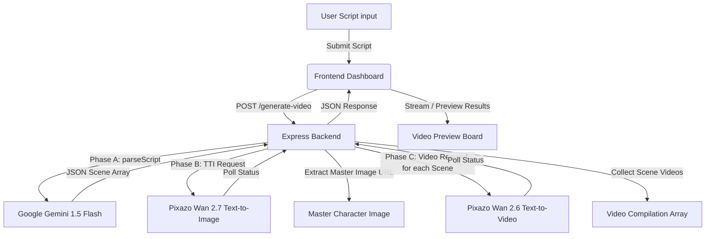

# 🌊 Vibe Video Flow (OpsDolly ScriptToScreen)
Vibe Video Flow is a cutting-edge web application designed to generate character-consistent, multi-scene videos directly from a single text script. By orchestrating a pipeline that combines the **Google Gemini API** for intelligent script parsing and the **Pixazo API (Wan 2.6 & Wan 2.7)** for high-quality text-to-image and text-to-video generation, it produces cinematic video sequences with character continuity.
---

## 🔗 Live Links
* **Frontend App:** https://vibe-video-flow-98rj.vercel.app/
* **Backend API:** https://vibe-video-flow.onrender.com

## 🚀 Key Features
*   **Intelligent Script Parsing (Phase A):** Automatically parses free-form scripts into structured 10-second scene sequences using Google's `gemini-1.5-flash` model.
*   **Consistent Character Generation (Phase B):** Generates a master reference image for a consistent protagonist (e.g., Dolly) using Pixazo's **Wan 2.7 Text-to-Image** model.
*   **Context-Aware Video Generation (Phase C):** Generates scene-by-scene high-definition video clips (16:9, 1080p, 10-seconds duration) using Pixazo's **Wan 2.6 Text-to-Video** model. Each scene description incorporates the master character concept description to ensure character consistency.
*   **Progressive Video Previewer:** A premium dark-themed dashboard built with **Next.js** and **Tailwind CSS** that displays the generated master character concept art and streams individual scene videos as they finish processing.
---
## 🛠️ Tech Stack
### Frontend
*   **Framework:** [Next.js](https://nextjs.org/) (App Router, TypeScript)
*   **Styling:** [Tailwind CSS v4](https://tailwindcss.com/)
*   **Component Library:** [Radix UI](https://www.radix-ui.com/) primitives & [Shadcn UI](https://ui.shadcn.com/) inspired design
*   **Icons:** [Lucide React](https://lucide.dev/)
### Backend
*   **Runtime:** [Node.js](https://nodejs.org/) & [Express](https://expressjs.com/)
*   **AI Integration:**
    *   `@google/generative-ai` (Gemini API)
    *   Pixazo API (Wan 2.7 TTI, Wan 2.6 TTV)
*   **HTTP Client:** Axios (with polling-based job status resolution)
---
## 📐 System Architecture
The following diagram illustrates how a script transforms into a final consistent video sequence:

---
## ⚙️ Environment Variables
### Backend Configuration (`backend/.env`)
Create a `.env` file inside the `backend` folder:
```env
PORT=5000
GOOGLE_API_KEY=your_google_gemini_api_key_here
PIXAZO_API_KEY=your_pixazo_api_key_here
```
### Frontend Configuration (`Frontend/.env.local`)
*(Optional)* Create a `.env.local` inside the `Frontend` folder to point to the backend API:
```env
NEXT_PUBLIC_API_URL=http://localhost:5000
```
*Note: If omitted, it defaults to `http://localhost:5000`.*
---
## 📥 Installation & Setup
Ensure you have [Node.js](https://nodejs.org/) (v18+ recommended) installed.
### 1. Set Up the Backend
```bash
cd backend
npm install
# Start the backend in development mode (with hot reloading)
npm run dev
```
### 2. Set Up the Frontend
```bash
cd Frontend
npm install
# Start the frontend next.js development server
npm run dev
```
The frontend will run at `http://localhost:3000` and the backend will run at `http://localhost:5000`.
---
## 🔌 API Documentation
### `POST /generate-video`
Processes the script, generates the character reference, and outputs the videos.
*   **Request URL:** `http://localhost:5000/generate-video`
*   **Request Method:** `POST`
*   **Request Body (JSON):**
    ```json
    {
      "script": "Scene 1: Dolly looking at the neon cityscape. Scene 2: Dolly programming at her desk.",
      "character_description": "Dolly, a vibrant young woman with curly auburn hair, wearing a stylish teal jacket."
    }
    ```
*   **Response (JSON):**
    ```json
    {
      "success": true,
      "master_image_url": "https://gateway.pixazo.ai/outputs/master_character_concept.png",
      "scenes_parsed": 2,
      "video_urls": [
        {
          "scene_number": 1,
          "visual_prompt": "Dolly looking at the neon cityscape",
          "url": "https://gateway.pixazo.ai/outputs/scene1.mp4",
          "status": "success"
        },
        {
          "scene_number": 2,
          "visual_prompt": "Dolly programming at her desk",
          "url": "https://gateway.pixazo.ai/outputs/scene2.mp4",
          "status": "success"
        }
      ]
    }
    ```
### `GET /health`
*   **Request URL:** `http://localhost:5000/health`
*   **Request Method:** `GET`
*   **Response:** `{ "status": "ok", "timestamp": "..." }`
